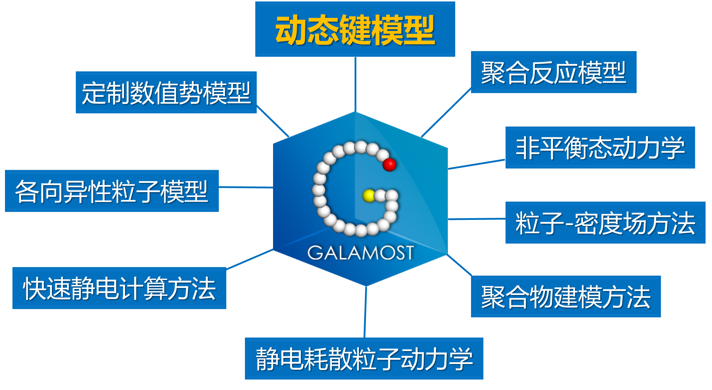
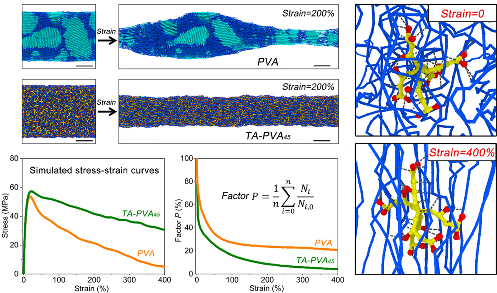
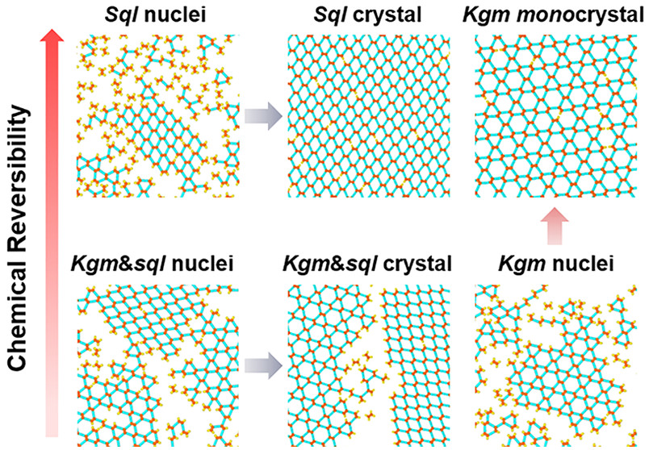

---
title:
date: 2022-10-24
type: landing

sections:
  - block: markdown
    content:
      title: 研究方向
      subtitle: ''
      text: 1.高分子/超分子的大尺度分子动力学模拟方法和软件

  - block: markdown
    content:
      title:
      subtitle: ''
      text: 2.高分子材料力学性能的分子机理

  - block: markdown
    content:
      title:
      subtitle: ''
      text: 3.共价有机框架的生长动力学
---
